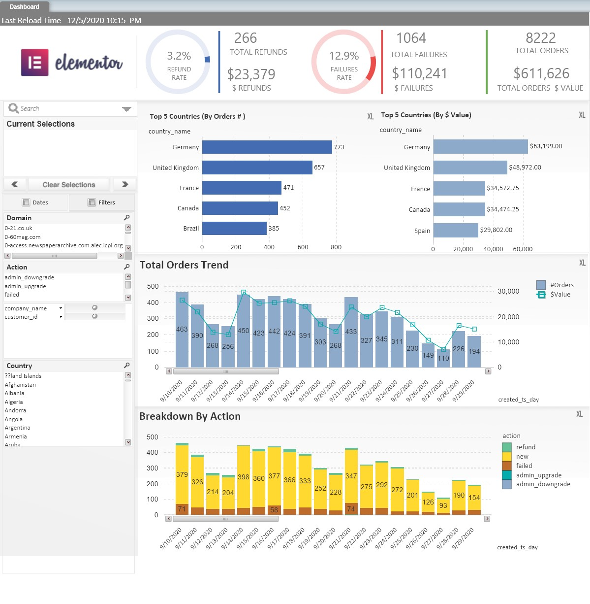

Notes:

i have loaded the 3 files into a local Postgres DB using Pyspark (see attached the notebook containing the code ).
i have built a sample dashboard using Qlikview (i have attached the QVW file and Qlikview desktop installation file ) :

honestly speaking i had some hard time understanding the function of the promotion data table and how it connects to the model , as its an aggregative table that contains only one dimension in form of date. this was the only connection that i have found with the sales table. unfortunatly this connection is not enought to answer question 3b. i was also asked to build distribution media cost per license type , but i didnt see this column in the data.

as for question 3a. the query is as follows:

select A.* from 
(
SELECT
	country_name,sum(net_total),
	RANK () OVER ( 
		order by sum(net_total) desc
	) rank_number 
FROM
	public.sales_data
	group by country_name 
	)A
where A.rank_number in (2,3);

as for additional insights and future directions i would check the following:

-  predictions : (Revenue \ Failures )
	- what is the predicted Revenue
	- what orders have probability to failure
- Deeper Failures and Refund analysis as i didnt see this info in the data set 
	

